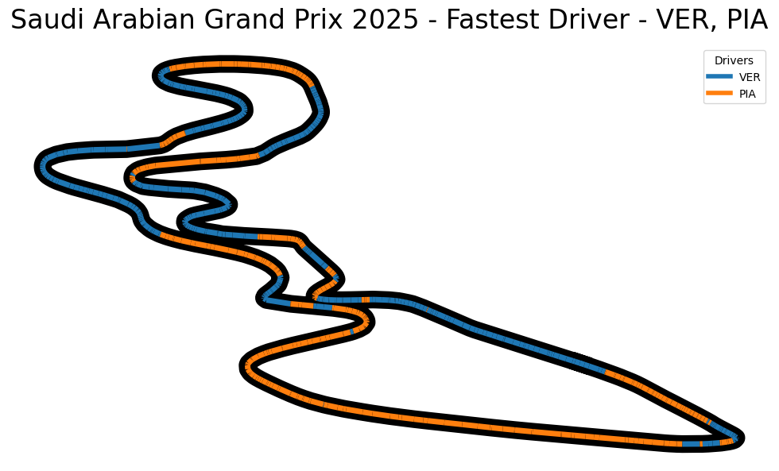

# 🏎️ F1 Pace Comparison

## Motivation 💡
As a Formula 1 enthusiast, I’ve always been fascinated by the intricate details of driver performance on the track. However, I couldn’t find a website or tool that allows for a direct, visual comparison of driver pace at different points on a circuit. This project was born out of that curiosity and a desire to create something that fills this gap. With this script, you can compare the pace of multiple drivers and visualize who is fastest at each point on the track. 🚀

---

## How to Use the Script 🛠️

1. **Install Dependencies**:
   - Make sure you have Python installed.
   - Install the required packages by running:
     ```bash
     pip install fastf1 matplotlib numpy
     ```

2. **Run the Script**:
   - Open the script in your favorite Python environment (e.g., Jupyter Notebook or VS Code).
   - Execute the script and follow the prompts:
     - Enter the year of the race (earliest supported is 2018).
     - Select the race weekend from the list of available events.
     - Choose the drivers you want to compare by entering their codes (e.g., `VER`, `HAM`, `LEC`).

3. **View the Results**:
   - The script will generate a visualization of the track, color-coded to show which driver was fastest at each point. Each driver is assigned a unique color, and a legend is included for easy reference.

---

## Example Output 📊
Here’s an example of what the script might display:

- A list of available race weekends:
    ```
    Available race weekends:
    0: Pre-Season Testing
    1: Australian Grand Prix
    2: Chinese Grand Prix
    3: Japanese Grand Prix
    4: Bahrain Grand Prix
    5: Saudi Arabian Grand Prix
    6: Miami Grand Prix
    ```

- A visualization of the track with color-coded segments showing the fastest driver at each point.
    
---

## Credits 🙌
This project wouldn’t have been possible without the amazing [FastF1](https://docs.fastf1.dev/index.html) package and the Formula 1 API it utilizes. FastF1 provides an easy-to-use interface for accessing and analyzing Formula 1 telemetry data, making it the perfect tool for projects like this. Huge thanks to the FastF1 team for their incredible work! 🎉

---

## Future Improvements 🚀
- Create a web-based interface for easier access and usability.
- Add other cool features using the fastf1 API
